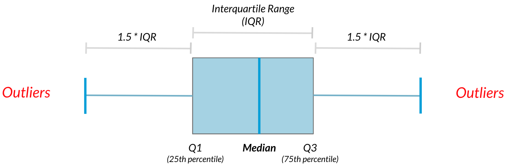

## types of statistic

- descriptive: summarize & describe
- inferential: use sample to inference

## types of data

- numeric
  - continuous (measure)
  - discrete (count)
- categorical
  - nominal (unordered)
  - ordinal (ordered)

## Median

the middle value of a sorted dataset; for even-sized datasets, the average of the two middle values

## Mean

the average; sum all values and divide by the count

## Mode

the most frequent occurring value

## Variance

how far data is spread out from mean

## Mean Absolute Distance

average distance between data points to the mean

## Standard deviation

a measure of how spread out values are from the mean; calculated as the square root of the average squared deviations from the mean

## IQR

