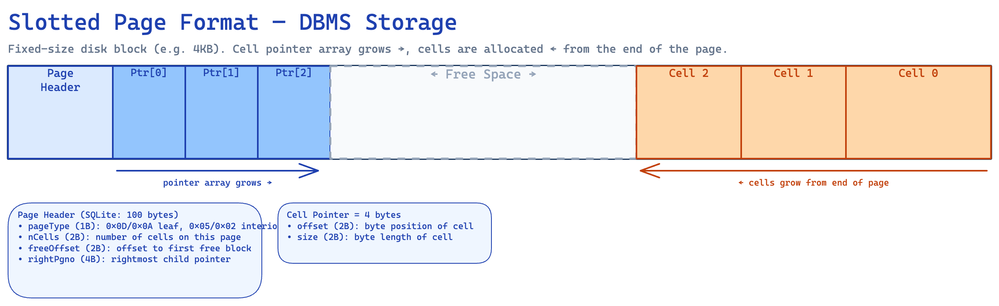

## Binary encoding

data --serialize--> bytes --save--> disk
disk --get--> bytes --deserialize--> data

### Primitive

fixed-size bytes:

1 byte -> 8 bits
short -> 2 bytes
int -> 4 bytes
long -> 8 bytes
float -> 32 bytes
double -> 64 bytes

5 as char = 1 byte, 5 as binary = 3 bits

5 used | 6 unused | 7 used | 8 unsued | 9 used|

#### Endianness - byte order

- Most Significant Bytes (MSB first)
  - Big-endian (0xAABBCCDD)
  - Network protocols (TCP/IP), most file formats
- Least Significant Bytes (LSB first)
  - Little-endian
  - Intel x86/x64 CPUs

### Variable-size data (String)

because strings are variable-length, save **length first**, then the bytes

### Bit-Packed Data: Booleans, Enums, and Flags

- instead of storing its true string value. Enums map named values to small integers: ROOT=0x00, INTERNAL=0x01, LEAF=0x02
- 1 byte for 8 Boolean -> Flags

> int IS_LEAF_MASK = 0x01h; // bit #1
> int VARIABLE_SIZE_VALUES = 0x02h; // bit #2
> int HAS_OVERFLOW_PAGES = 0x04h; // bit #3

### Benefit

Binary encoding stores data in compact, fixed-width binary formats instead of human-readable text — making databases dramatically faster to read, write, and search at scale.

## Cell

- key
  - key size
  - key data
  - child page id
- key-value
  - flag
  - key size
  - value size
  - key data
  - value data

## Slotted page

- headers (metadata, cell type, checksum, ...)
- offset (left)
- cell (right)

### insert

offset decide the order

new offset shift right

- first fit
- best fit

when there not enough consecutive bytes -> live cells are read and rewritten, defragmenting the page and reclaiming space for new writes

### delete

nullify pointer, mark data as deleted. Marked data is only deleted via compaction (also called page reorganization or vacuum)

## checksum

identify when a bit is corrupted

## version

- Database binary file formats change over time
- support at least 2 (current and previous)
- approaches:
  - Version prefix in filename
  - Separate version file
  - Version in the file header

<!-- As a DevOps or Platform Engineer, you don't necessarily need to memorize how to write a C parser for binary structs, but Chapter 3 of *Database Internals* contains crucial concepts that directly impact **database performance, storage provisioning, and operational troubleshooting**.

Here are the key takeaways you should remember from this chapter:

### 1. Page Sizes and Storage Alignment
*   **The Concept:** Databases don't write data row-by-row to the disk; they group data into fixed-size blocks called **Pages** (usually between 4 KB and 16 KB). 
*   **DevOps Impact:** When provisioning storage (like AWS EBS volumes) or formatting a filesystem (like ext4 or XFS), you must ensure your filesystem block size aligns with your database's page size. If your DB page is 16KB but your filesystem block is 4KB, a single database write could trigger multiple I/O operations, leading to severe write amplification and degraded IOPS performance.

### 2. Slotted Pages and "Vacuuming" (Fragmentation)
*   **The Concept:** To handle variable-sized data (like strings or JSON) without wasting space, databases use a layout called **Slotted Pages**. When a record is deleted, it isn't actually erased; it is just marked as "deleted," and its space is added to an internal "availability list" to be reused later.
*   **DevOps Impact:** If space isn't perfectly reused, pages become heavily fragmented. This is the exact underlying reason why databases require maintenance operations like `VACUUM` (in PostgreSQL) or `OPTIMIZE TABLE` (in MySQL). These operations rewrite and defragment the slotted pages to reclaim raw disk space.

### 3. Checksumming and Data Corruption
*   **The Concept:** Hardware degrades, disks flip bits, and network transfers drop packets. To detect this, databases compute **Checksums or CRCs (Cyclic Redundancy Checks)**.
*   **DevOps Impact:** Checksums are stored in the *Page Header*, meaning the database checks integrity on a page-by-page basis rather than the whole file at once. If you get pager alerts for "Checksum mismatch" or "Corrupted page," it means your underlying storage layer (the disk, controller, or EBS volume) is likely failing or silently corrupting data, and you shouldn't trust the data read from that block. 

### 4. File Versioning and Upgrades
*   **The Concept:** As database software evolves, its binary format changes. Databases track the binary format version either in the filename (like Cassandra: `na-1-bigData.db`) or in special metadata files/headers (like PostgreSQL's `PG_VERSION`).
*   **DevOps Impact:** This is why you cannot always just attach an old data volume to a newly upgraded database container. When planning major version upgrades, the database engine must be able to read the old binary format and often requires a time-consuming migration step to rewrite the pages into the new binary layout.

### 5. Overflow Pages
*   **The Concept:** If a row (like a massive JSON blob) is too large to fit inside a standard 4KB/16KB page, the database has to spill that data out into separate **Overflow Pages**.
*   **DevOps Impact:** Accessing overflow pages requires extra disk I/O. If developers are storing massive payloads in the database and complaining about slow read speeds, this is the architectural reason why. It often warrants pushing back and suggesting they store large blobs in S3 and only store the URL in the database. -->