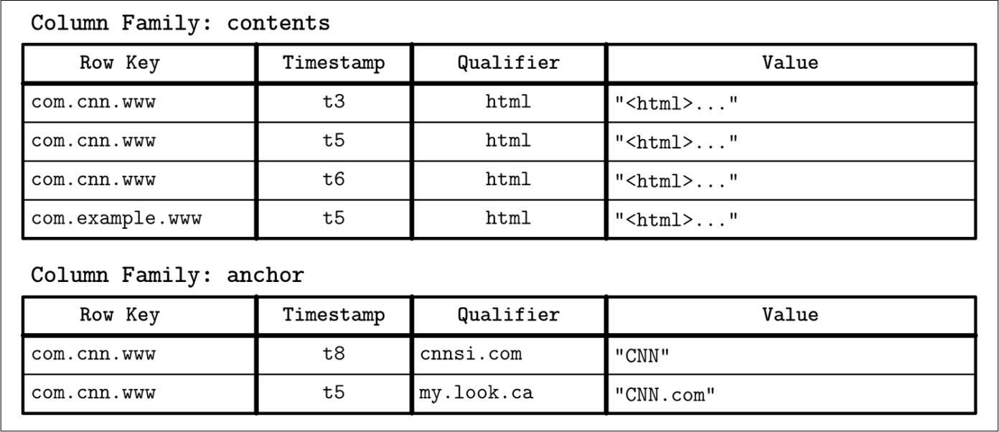
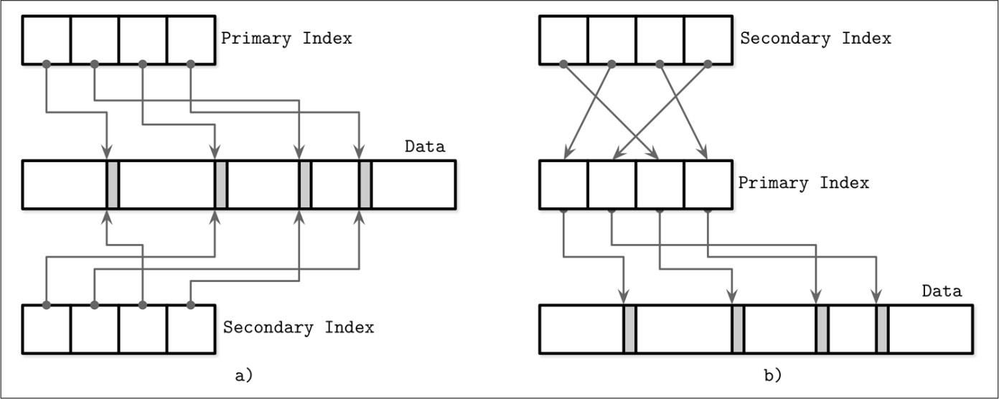

## Components

- transport layer (handle requests)
- query processor
- execution engine
- storage engine
  - Transaction Manager
  - Lock Manager: combine with TM to handle concurrency control
  - Access Methods: manage access and organizing data on disk
  - Buffer Manager: cache data pages
  - Recovery Manager

## Things to consider when comparing databases

- Schema and record sizes
- Number of clients
- Rates of read and write queries
- Types of queries and access pattern
- Expected changes in any of these variables

Knowing these variables can help to answer the following questions:

- Does the database support the required queries?
- Is this database able to handle the amount of data we’re planning to store?
- How many read and write operations can a single node handle?
- How many nodes should the system have?
- How do we expand the cluster given the expected growth rate?
- What is the maintenance process?

## Column- Versus Row-Oriented DBMS

- reading data with same type saves CPU & Mem - better compression
- use access pattern to decide: if scans span many rows, or compute aggregate over a subset of columns, it is worth considering a column-oriented approach.

## Wide Column Stores

data is represented as **multidimensional map**

## Data Files

### Implementation types

- heap organized tables (heap files): records stored randomly
- hashed organized tables (hashed files): records are hashed and stored in bucket according to the hash value
- index organized tables (IOT): stored in key order, range scans work by sequential scanning

read record speed increase but write decrease

## Index Files

Index Files contain data structure which act as a map to point out locations of records

an index of a record are primary key(index) which create a properties or a set of properties, and secondary index which can point directly to data record or store its primary index

data which is sort following the index order is call **clustering** while the one is not sorted call **non-clustering**

## Primary index as an indirection

secondary indexes point:

- directly to file offset (location where record is stored in a file)
- to primary index, increase disk seeks - pointer jump but reduce update cost
- hybrid: stores both file offset and primary key. On read, checks if the offset is still valid (1 disk seek); if stale, falls back to the primary key index and updates the cached offset. Cheaper than pure indirection on the happy path, but pays extra when records have moved — best suited for read-heavy workloads where records are rarely relocated.

## Buffering, Immutability, Ordering

distinctions and optimizations of storage data structure are based on these 3 concepts

### some implementations decide to avoid it to reduce

- complexity
- memory overhead
- data loss

## Glossary

### What is a transaction?

a sequence of database operations where all changes are either committed (success) or rolled back (fail), ensuring data consistency

### What is buffer?

a temporary storage area in memory

### what is a page?

the smallest unit of data that a database reads from/writes to disk or memory. a page contains multiple rows

### write-ahead log (WAL)

a durability mechanism to ensure **data consistency** even after crashes. There are 2 types: redo log, undo log

### Types

- OLTP - Online Transaction Processing: high-concurrency, short-lived read/write queries on individual records; ACID-compliant
- OLAP - Online Analytic Processing: data warehouse
- HTAP - Hybrid Transaction and Analytic Processing

## Q&A

### Why client/cluster communication do not share the same protocol?

node-to-node uses low-level language to communicate for speed, human requires a readable language (SQL)

## Why does a system need to implement a memory cache while it already has a buffer manager?

**Buffer manager** optimizes for general-purpose database workloads but still incurs overhead: query parsing, transaction locks, ACID logging. **Memory database** optimizes purely for speed with simple access patterns.

Examples:

- User session lookup: Database needs `SELECT * FROM sessions WHERE id=?` (parsing + planning). Cache does `GET session:123` (O(1) hash).
- Buffer manager caches what *fits*, but you can't control it. Memory database lets you explicitly cache hot data (trending posts, real-time counters).
- Database guarantees consistency (costs: locks, WAL logging). Cache trades consistency for speed—acceptable for data that doesn't need durability (session tokens, rate limits).

**Pattern**: Hot data → Redis (key-value, no ACID overhead) | Warm data → Database buffer manager | Cold data → Disk only

## Does a single node db cluster implement WAL?

## How does an application respond when the database crashes mid-processing? Does it keep the user waiting?

vacum
cost query
ACID
LOG
Aura share nothing
index (cluster, second, ...)
metric
detect deadlock, slow query
EVCC
transaction manager

