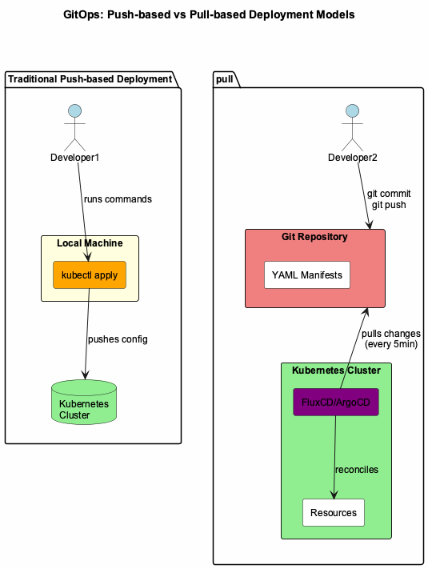

## The Pre-GitOps Pain

Before GitOps, I worked on a project using old version Octopus Deploy as the CD tool. Configuration changes happened in the UI, and tracking who changed what was a nightmare. The audit page was so laggy it was practically unusable—thousands of events made it crawl to a halt. When something broke, tracing back the change that caused it felt like archaeology.

That experience taught me the core problems with imperative, UI-driven infrastructure management:

- **No audit trail**: Changes happened through SSH sessions, local kubectl commands, or worse—clicking through web UIs
- **Environment drift**: No guarantee that dev matched prod, or that what you tested would work in production
- **Bus factor of 1**: Only I knew what was deployed and how
- **Deployment anxiety**: Every change felt risky because I couldn't easily roll back
- **Documentation rot**: Docs lived separately from code and were always outdated
- **Performance issues at scale**: UI-based tools struggle when you need to audit hundreds or thousands of changes

## What GitOps Promises

GitOps promised to solve all of this with one elegant principle: **Git is the single source of truth**.

The core tenets:

- Every infrastructure change goes through a PR/MR
- Every cluster state is versioned in Git
- Every deployment is auditable with commit history
- The cluster actively pulls configuration from Git, rather than operators pushing changes in

This shift from push to pull is fundamental. Instead of running `kubectl apply` from my laptop, I commit to Git and the cluster reconciles itself to match. The cluster becomes self-healing—if someone manually changes a resource, GitOps reverts it back to the Git state.

*Figure 1: GitOps pull-based model vs traditional push-based deployment*

But choosing GitOps was the easy part. Choosing the right tool was harder.

## My thoughts on FluxCD vs. ArgoCD

In every GitOps project I joined before 2025, ArgoCD was always the chosen tool. However, I got the chance to try Flux when I participated in a project with limited CPU and RAM resources and a team comfortable with CLI workflows. Here are my thoughts on both tools:

**Choose FluxCD if**:

- You prefer declarative, Kubernetes-native configuration
- You want Flux to manage itself via GitOps
- You're comfortable with CLI and YAML workflows
- You need modular component selection
- You're managing infrastructure as code for technical teams

**Choose ArgoCD if**:

- You want a powerful web UI for visualization and operations
- You need sophisticated multi-tenancy and RBAC
- You're onboarding non-Kubernetes-expert teams
- You value the larger ecosystem and community
- You need explicit sync waves for complex orchestration

### A Word of Caution: Don't Miss the Point

I once worked on a project that adopted ArgoCD for the pull-based GitOps model, but the team was still using `argocd app sync` CLI commands to manually trigger syncs. They did this because they wanted to "know when sync is done"—but here's the problem: the CLI would report success even when the sync wasn't finished or, worse, hadn't executed at all.

They were using a GitOps tool but completely missing the point. The power of GitOps is automatic reconciliation—Git changes trigger syncs, not humans. What they needed was ArgoCD Notifications to alert them when syncs completed or failed, which I failed to introduce to the team.

The lesson: **Pick a tool that aligns with your philosophy, and use it correctly**. If you choose ArgoCD, embrace auto-sync and notifications. Don't fall into the trap of manual CLI triggers that defeat the purpose of GitOps.

## What's Next

Now that you understand why I chose FluxCD, the next posts will dive into implementation:

In Part 2, I'll show you the repository structure that makes multi-environment GitOps manageable and scalable.

<!-- - **[Part 2: Repository Architecture](../fluxcd-part2-architecture)** - How to structure a multi-cluster GitOps repository
- **[Part 3: Bootstrapping with Flux Operator](../fluxcd-part3-bootstrapping)** - Declarative Flux installations and configuration
- **[Part 4: ResourceSets and Dependencies](../fluxcd-part4-resourcesets)** - Managing complex deployment chains
- **[Part 5: Production Operations](../fluxcd-part5-production)** - Helm, secrets, certificates, and monitoring
- **[Part 6: Lessons Learned](../fluxcd-part6-lessons)** - Real-world gotchas and best practices -->