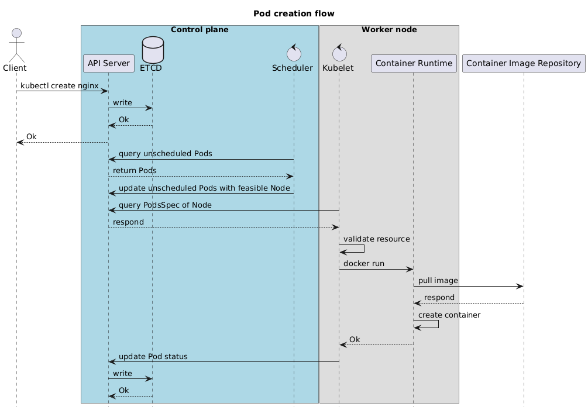

### Block vs Object vs File storage

| Feature       | Object Storage           | Block Storage           | Network Storage           |
| ------------- | ------------------------ | ----------------------- | ------------------------- |
| Data Unit     | Object (data + metadata) | Block (raw data chunks) | File (organized in paths) |
| Access Method | Restful APIs             | FC/iSCSI                | NFS/SMB                   |
| Use Case      | Archival, media storage  | Databases, VMs          | Shared file access        |
| Performance   | High scalability         | High IOPS, low latency  | Moderate performance      |

### what are root causes of deadlock?

4 conditions happen at the same time:

- Mutual Exclusion
- Hold and Wait
- No Preemption (no process is able to force another process release resource)
- Circular Wait

### What is machine code

Code executed by CPU

### machine code vs byte code

| Machine code            | Byte code                             |
| ----------------------- | ------------------------------------- |
| instructions run by CPU | code run by virtual machine (JVM, V8) |

### What kind of file does Rust compile to?

Machine code

### What tools are used to read instruction from binary file?

`obj_dump` & `xxd` CLI

### How many types of instruction?

1. Data Movement: move data between registers, memory, and I/O devices.
2. Arithmetic: perform mathematical operations on data.
3. Logical: perform logical operations on binary data.
4. Control Flow: alter the sequence of execution in a program.
5. Comparison: compare two operands and set condition flags based on the result.
6. Shift and Rotate: perform bit-shifting or bit-rotation operations on data.
7. Input/Output: handle communication between the processor and external devices or memory.
8. Nop (No Operation)
NOP: A no-operation instruction that does nothing. It is often used for timing, debugging, or alignment purposes.
9. Exception and Interrupt: manage interrupt handling and exceptions.
10. System Control: interact with the system or control the processor's behavior.
11. Floating Point: handle floating-point operations, which are important for calculations that involve real numbers.

### Stack vs Heap vs Static memory

| stack  | heap                              | static memory    |
| ------ | --------------------------------- | ---------------- |
| scoped | ownership                         | program duration |
| LIFO   | jumping from 1 pointer to another | data/BSS segment |

### Rust's array is located in stack, how about tuple?

stack also, but content of it could be heap

### what are the differences between &String and &str ?

| Feature     | String                  | &str                       | &String                       |
| ----------- | ----------------------- | -------------------------- | ----------------------------- |
| Ownership   | Owned, heap-allocated   | Borrowed, immutable        | Borrowed reference            |
| Mutability  | Mutable                 | Immutable                  | Immutable                     |
| Memory      | Heap                    | Stack or Heap              | Heap                          |
| Conversion  | Can be borrowed as &str | Can be converted to String | Automatically coerces to &str |
| Typical Use | Owned, growable string  | Immutable view of data     | Immutable borrowed view       |

### How does Scheduler create a `Pod`?

- Scheduler does not create a Pod
- Scheduler scores node (affinity, taint, toleration, ...) -> notify API server -> ETCD 
- Kubelet get info from API server-> create container

### How a new pod is created in Kubernetes cluster?



### how it score nodes???

### manage platform service (operation) là làm những gì???

- installation
- incident management
- downtime management
- update & patching
- observability
- config management
- performance optimization
  - optimize system components
  - reduce bottle neck
  - ...
- backup & recovery
- Hardening
- Cost optimization

### Does downtime happen when an incident occur?

scheduled downtime

### term dung de tranh downtime incident? plan han che code + ops ngu

### What is Hardening? vs Computer Security???

1. Secure Coding ??
   1. scan code for sensitive content
   2. scan dependencies
2. enforce Authn and Authz
3. data encryption

### what can Kong do?

API Gateway
Ingress Controller

### What API Gateway can do? giai quyet van de gi???

1. centralizes API requests
2. applies policies
3. manages routing

### What the differences between ingress, egress and api gateway?

| Feature           | Ingress                                   | Egress                                         | API Gateway                                         |
| ----------------- | ----------------------------------------- | ---------------------------------------------- | --------------------------------------------------- |
| Primary Focus     | Managing incoming traffic to services.    | Managing outgoing traffic to external systems. | Managing API traffic (both ingress & egress).       |
| Scope             | Network-level HTTP/HTTPS traffic.         | Network-level outbound traffic.                | Application-level API requests and responses.       |
| Key Functionality | Routing, SSL termination, load balancing. | Traffic control, security, monitoring.         | Authentication, rate limiting, monitoring, routing. |
| Use Case          | Exposing services to external clients.    | Restricting or monitoring outgoing traffic.    | Centralized API management for microservices.       |
| Example Tools     | Nginx, Traefik, Kubernetes Ingress.       | Egress Gateways (Istio, Calico).               | Kong, Istio, Amazon API Gateway, Apigee.            |

### tại sao chạy e2e test using docker compose ?

-> embbed postgres (jonkey)

### worker gọi master khi nào và ngược lại?

kubelet

### What are use cases for each types of AWS Load Balancer?

| Feature          | Application LB (ALB)         | Network LB (NLB)       | Gateway LB (GWLB)  | Classic LB (CLB) |
| ---------------- | ---------------------------- | ---------------------- | ------------------ | ---------------- |
| Layer            | 7 (Application)              | 4 (Transport)          | 3 (Network)        | 4 & 7            |
| Protocols        | HTTP, HTTPS, WebSocket       | TCP, UDP, TLS          | IP                 | HTTP, HTTPS, TCP |
| Advanced Routing | Path, Host-based             | Not Supported          | Not Supported      | Not Supported    |
| Targets          | EC2, Lambda, IPs, Containers | EC2, IPs               | Virtual Appliances | EC2 only         |
| Latency          | Moderate                     | Ultra-low              | Moderate           | Moderate         |
| Best for         | Web applications, APIs       | Real-time applications | Security tools     | Legacy workloads |

not ALB -> CLB ? when we need other protocol in layer 7 (DNS, SMTP, FTP,...) except HTTP & HTTPS
not NLB -> CLB ? when you need features like Sticky Sessions, SSL Termination
apply tracing into Morpheuslabs, Zipkin

worker gọi master khi nào và ngược lại?

### Why API Server not sending request to Kubelet, but Kubelet have to make a request to API Server??? Not yet

1. Scalability

- Each connection to API Server will be manage by Kubelet
- Reduce the heavy workload for API Server in pull-based model

2. Reliability

- In push model, if the API Server fail every `pending` request will be lost
- In pull model, Kubelet will operate the retry mechanism base on the last known state
- API Server + ETCD act as a source of truth, they don't have to manage the Kubelet state

### How to measure performance of a (MySQL) server???

- Throughput: Measures how many queries MySQL can process in a second. Example: 10,000 queries executed in 10 seconds = 1,000 QPS. Formula: `Throughput=Total Queries Executed/Execution Time​`
- Latency (Execution Time): The time it takes to execute a single query.
- Connections (Concurrency): Maximum concurrent connections supported without degradation in performance.
- I/O Performance: Measures the speed of read/write operations

### before coredns is there any mechanism to resolve DNS in k8s cluster???

### tool draw -> code -> diagram, có gọi là diagram as code ko? dựa vào đâu gọi nó là diagram as code? 

CODE as source of truth

### What is digital signatures

### How pub/sec keys of CA are use in PKI?

pub -> decrypt | prv -> encrypt

normal case, encrypt = pub key because multi clients -> server decrypt (harder) => prv (need to protect) uses for decrypt

digital signature, encrypt = prv (harder) only server can encrypt, pub key used to decrypt

diff CA digital signature (DS) vs server DS

### what does server's certificate used for?

- Authentication
- Encryption

#### what is a protocol?

A set of rules for:

- formatting
- processing data

Example: Transmission Control Protocol (TCP)

- Data process:
  - Connection setup: 3-way handshake
  - Data transmission: send & acknowledge data packet
- Format:
  - TCP Header Example:

  ```css
  [Source Port: 16 bits][Destination Port: 16 bits]
  [Sequence Number: 32 bits][Acknowledgment Number: 32 bits]
  [Data Offset][Flags][Window Size][Checksum][Urgent Pointer]
  ```

  - Data Section: Contains the payload being transmitted.

#### why protocols is needed?

These rules are used to create a common language for computers which use different software but still want to communicate to each other

#### what is TLS?

- security protocol
- designed to facilitate privacy and data security

#### what is mTLS?

an extension of TLS, not only Server send certificate to Client but the Client also need to send its certificate to Server

#### in K8s use TLS or mTLS? where?

- mTLS is used to communicate internally in the cluster
- TLS is used for external client (e.g. a client send a request to a service in K8s cluster)

### can we CA in k8s cluster for web?

- No, because the root CA can not be downloaded by client

### EKS authn request from kubectl?

IAM role + access entry -> cluster user